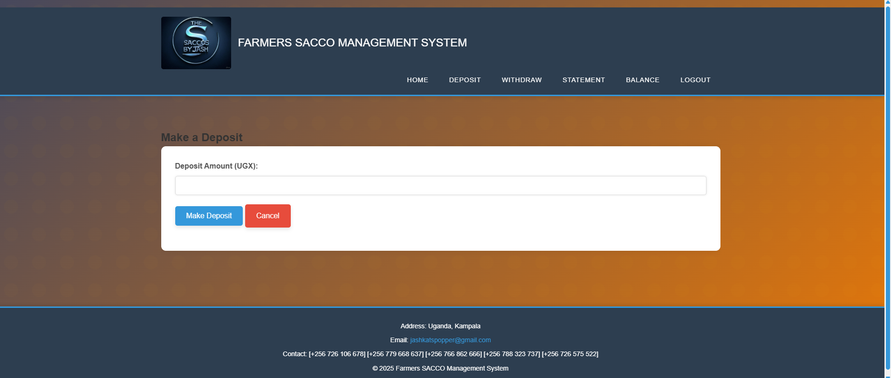
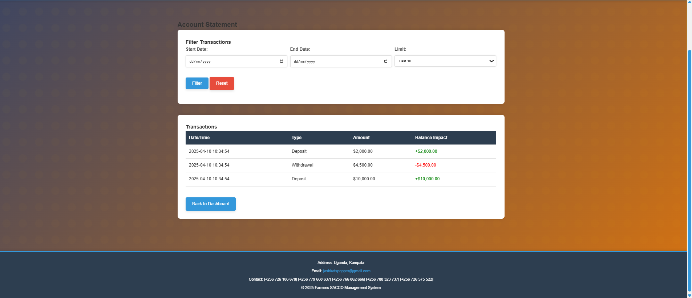
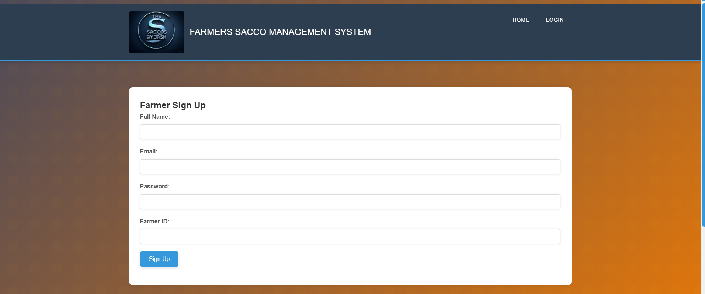
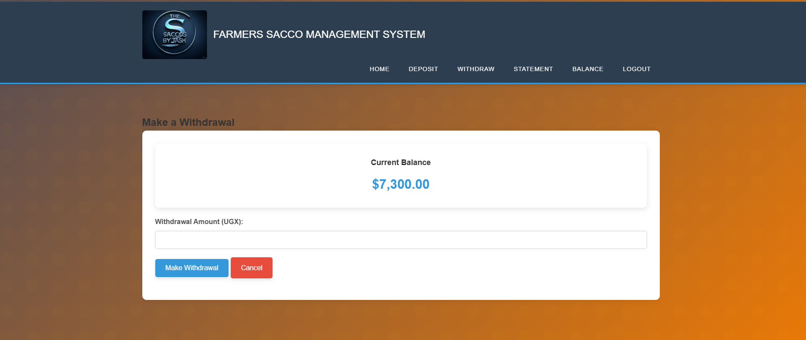
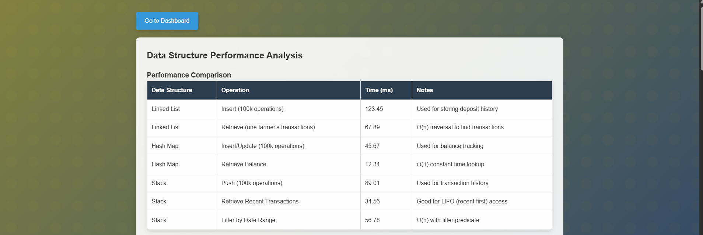
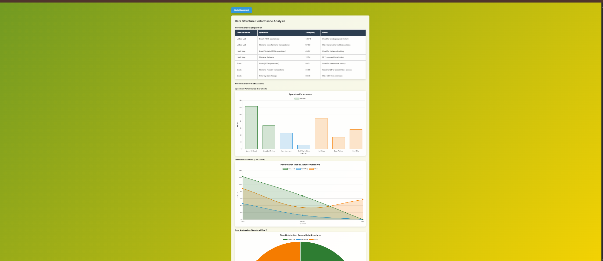

# SACCO Management System

## Project Overview

The **SACCO Management System** is a web-based platform designed to facilitate financial management for cooperative societies (SACCOS). The system allows users to sign up, deposit money, withdraw funds, and view their financial transactions and performance. This system is built using **PHP**, **HTML**, **CSS**, and **MySQL** for database management.

---

## Features

- **Dashboard View**: Displays an overview of the user's account, including balances, recent transactions, and more.
- **Login Page**: Allows users to securely log in to their account.
- **Signup Page**: New users can register for an account.
- **Withdraw View**: Users can request withdrawals from their accounts.
- **Deposit View**: Allows users to make deposits into their accounts.
- **Data Structures View**: Compare the efficiency of different data structures (Linked List, Stack, Queue, Hash Map) used to manage financial transactions.
- **Performance View**: Displays graphs and reports to track the financial performance of the user over time.

---

## Screenshots

### 1. **Dashboard View**
   The Dashboard provides users with an overview of their financial activity, including recent transactions and balance updates.

   

### 2. **statement view**
   user can view their statements and history

   

### 3. **Signup Page**
   New users can create an account by providing their details.

   

### 4. **Withdraw View**
   This page allows users to initiate withdrawals from their accounts.

   

### 5. **Deposit View**
   Users can deposit money into their accounts through this page.

   

### 6. **Data Structures View**
   This view demonstrates the efficiency of different data structures in managing financial transactions.

   

### 7. **Performance View**
   Users can track their financial performance over time with visual graphs and data.

   

---

## How to Set Up the Project Locally

### Prerequisites

- **PHP** (Version 7.4 or higher)
- **MySQL** database
- **A local server environment** like **XAMPP**, **WAMP**, or **MAMP**

### Installation Steps

1. **Clone the Repository**  
   Clone this repository to your local machine using:
   ```bash
   git clone https://github.com/username/repository-name.git
